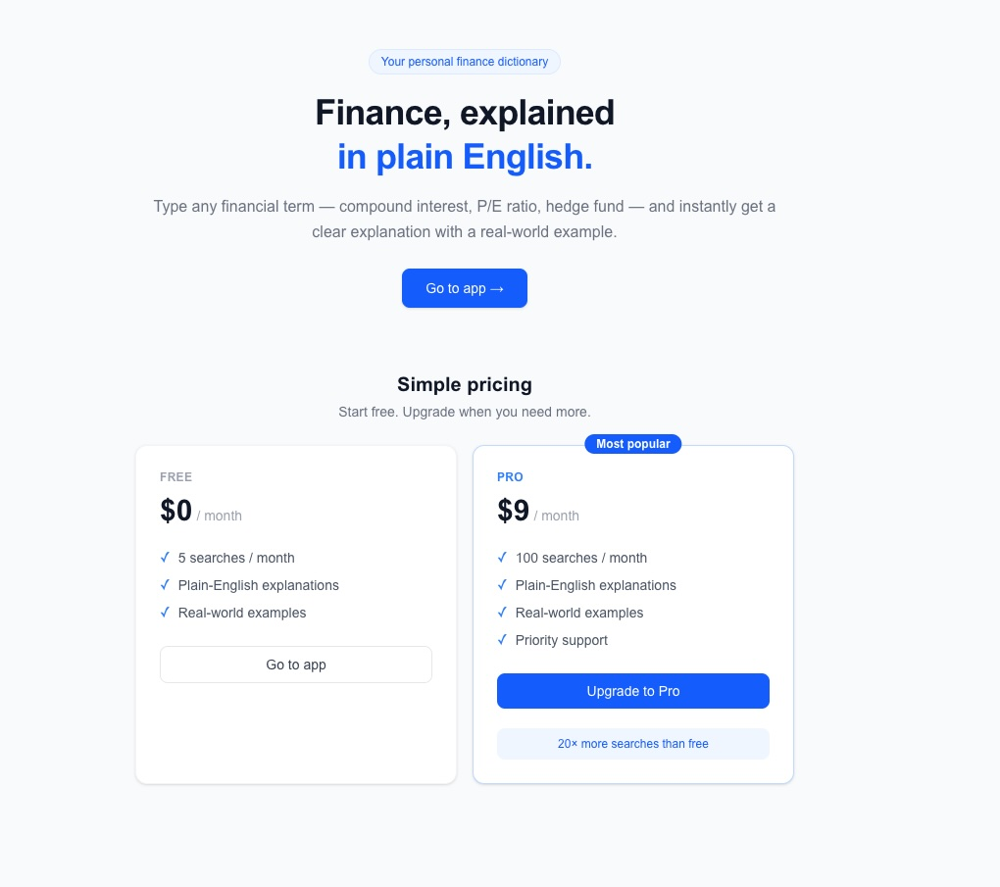

# Finance Advisor

A minimalist single-page app that explains any financial term in plain English with a real-world example — powered by OpenAI GPT-4o-mini and streamed live to the browser.



---

## Features

- **Instant explanations** — type any financial term and get a clear 2–3 sentence explanation with a concrete example
- **Live streaming** — response streams token-by-token via Server-Sent Events (SSE)
- **Authentication** — sign-in / sign-up powered by Clerk
- **Usage limits** — free tier (5 searches/month) and Pro tier (100 searches/month), enforced server-side via Clerk metadata
- **Subscription pricing** — pricing section on the landing page tied to Clerk billing plans
- **Fully typed** — TypeScript throughout

---

## Tech Stack

| Layer | Technology |
|---|---|
| Framework | [Next.js 16](https://nextjs.org) — Pages Router |
| Language | TypeScript |
| Styling | [Tailwind CSS v4](https://tailwindcss.com) |
| Auth & Billing | [Clerk](https://clerk.com) |
| LLM | [OpenAI GPT-4o-mini](https://platform.openai.com) |
| SSE client | [@microsoft/fetch-event-source](https://github.com/Azure/fetch-event-source) |
| Deployment | [Vercel](https://vercel.com) |

---

## Project Structure

```
fin-advisor/
├── pages/
│   ├── _app.tsx                  # ClerkProvider wraps the whole app
│   ├── _document.tsx             # HTML document shell
│   ├── index.tsx                 # Landing page — hero + pricing section
│   ├── app.tsx                   # Main app — search + explanation
│   ├── sign-in/
│   │   └── [[...index]].tsx      # Clerk hosted sign-in page
│   └── api/
│       └── explain.ts            # POST /api/explain — auth, quota, OpenAI stream
├── components/
│   ├── SearchBar.tsx             # Controlled input + submit button
│   └── ExplanationCard.tsx       # Renders term, explanation, example
├── types/
│   └── index.ts                  # Shared TypeScript types
├── styles/
│   └── globals.css               # Tailwind base styles
├── middleware.ts                 # Clerk middleware — protects /app, allows / and /sign-in
├── api/
│   └── index.py                  # Legacy FastAPI backend (local Python dev only)
└── requirements.txt              # Python dependencies for FastAPI backend
```

---

## Getting Started

### Prerequisites

- Node.js 18+
- A [Clerk](https://clerk.com) account with a project set up
- An [OpenAI](https://platform.openai.com) API key

### 1. Clone the repo

```bash
git clone https://github.com/your-username/fin-advisor.git
cd fin-advisor
```

### 2. Install dependencies

```bash
npm install
```

### 3. Set up environment variables

Create a `.env.local` file at the project root:

```env
# Clerk — get these from Clerk Dashboard → API Keys
NEXT_PUBLIC_CLERK_PUBLISHABLE_KEY=pk_test_...
CLERK_SECRET_KEY=sk_test_...

# OpenAI — get this from platform.openai.com → API Keys
OPENAI_API_KEY=sk-proj-...
```

### 4. Run the development server

```bash
npm run dev
```

Open [http://localhost:3000](http://localhost:3000).

---

## Environment Variables

| Variable | Required | Description |
|---|---|---|
| `NEXT_PUBLIC_CLERK_PUBLISHABLE_KEY` | ✅ | Clerk publishable key (exposed to browser) |
| `CLERK_SECRET_KEY` | ✅ | Clerk secret key (server-side only) |
| `OPENAI_API_KEY` | ✅ | OpenAI API key (server-side only) |

> `CLERK_SECRET_KEY` and `OPENAI_API_KEY` are never sent to the browser — they are only read inside `pages/api/explain.ts` which runs on the server.

---

## How It Works

```
User types a term
      │
      ▼
POST /api/explain  (Next.js API route)
      │
      ├─ getAuth(req) ──────────────► Clerk validates session / JWT
      │
      ├─ getUserMetadata() ─────────► Clerk REST API
      │    reads publicMetadata.plan         → "free" | "pro"
      │    reads privateMetadata.search_count + reset_month
      │
      ├─ count ≥ limit? ────────────► HTTP 429 → upgrade prompt in UI
      │
      ├─ updatePrivateMetadata() ───► increment search_count in Clerk
      │
      ├─ OpenAI stream ─────────────► gpt-4o-mini, response_format: json_object
      │
      └─ SSE response ──────────────► X-Searches-Remaining / Limit / Plan headers
                                       data: {json fragment}\n\n  (streamed)

Client (fetchEventSource)
      │
      ├─ onopen    → read usage headers, handle 429
      ├─ onmessage → accumulate JSON fragments
      └─ stream closed → JSON.parse → render ExplanationCard
```

---

## Usage Limits & Subscription

Limits are enforced **server-side** on every request — they cannot be bypassed by the client.

| Plan | Searches / month | How to set |
|---|---|---|
| Free (default) | 5 | New users start here automatically |
| Pro | 100 | Set `publicMetadata.plan = "pro"` in Clerk when a user subscribes |

**Monthly reset** — the counter resets automatically when the calendar month changes (tracked via `privateMetadata.reset_month`).

**Clerk metadata fields used:**

```json
// publicMetadata  (readable client-side)
{ "plan": "free" }

// privateMetadata  (server-side only)
{ "search_count": 3, "reset_month": "2026-05" }
```

---

## Deploying to Vercel

1. Push the repo to GitHub
2. Import the project at [vercel.com/new](https://vercel.com/new)
3. Add the following **Environment Variables** in Vercel → Settings → Environment Variables:

| Key | Value |
|---|---|
| `NEXT_PUBLIC_CLERK_PUBLISHABLE_KEY` | your Clerk publishable key |
| `CLERK_SECRET_KEY` | your Clerk secret key |
| `OPENAI_API_KEY` | your OpenAI API key |

4. Click **Deploy** — no build configuration needed, Vercel auto-detects Next.js

> The FastAPI backend (`api/index.py`) is **not deployed to Vercel**. All backend logic runs inside the Next.js API route `pages/api/explain.ts`.

---

## Local Python Backend (Optional)

A FastAPI version of the backend is kept in `api/index.py` for local Python development and experimentation.

```bash
# Create and activate virtual environment
python -m venv venv
source venv/bin/activate          # Windows: venv\Scripts\activate

# Install dependencies
pip install -r requirements.txt

# Add backend env vars to .env
echo "CLERK_JWKS_URL=https://your-clerk-domain/.well-known/jwks.json" >> .env
echo "CLERK_SECRET_KEY=sk_test_..." >> .env
echo "OPENAI_API_KEY=sk-proj-..." >> .env

# Run
uvicorn api.index:app --reload --port 8000
```

Health check: [http://localhost:8000/health](http://localhost:8000/health)

---

## Scripts

```bash
npm run dev      # Start development server on :3000
npm run build    # Production build
npm run start    # Start production server
npm run lint     # Run ESLint
```

---

## License

MIT
